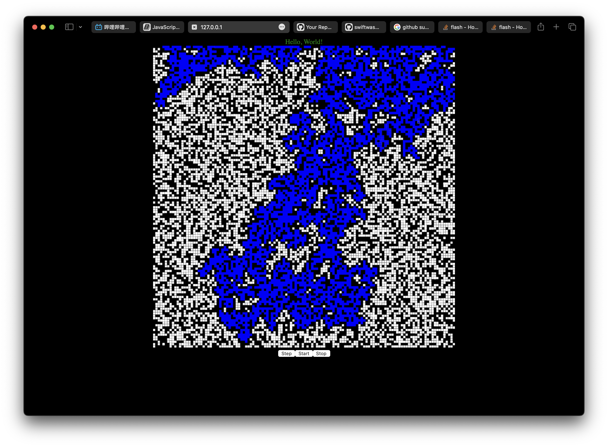

# LifeGame with SwiftWasm

https://kateinoigakukun.github.io/swiftwasm-game-of-life/

## Requirements

- [swiftwasm/carton: SwiftWasm Tool](https://github.com/swiftwasm/carton)

## Development

```sh
open Package.swift
carton dev
```

Some Swifty Style UI.
```swift
@main
struct MyApp: WebApp {
    static let canvas = Canvas()
    var simulator: Simulator = Simulator(board: BoardCanvas(canvas: canvas.object.object!, n: 128, length: document.body.clientHeight.number! * 0.8))
    
    var body: [HTML] {
        Div(with: "Hello, World!")
        Self.canvas
        Div {
            Button("Step") {
                simulator.step()
                print("Step")
            }
            Button("Start") {
                simulator.start()
            }
            Button("Stop") {
                simulator.stop()
            }
        }
    }
}
```


